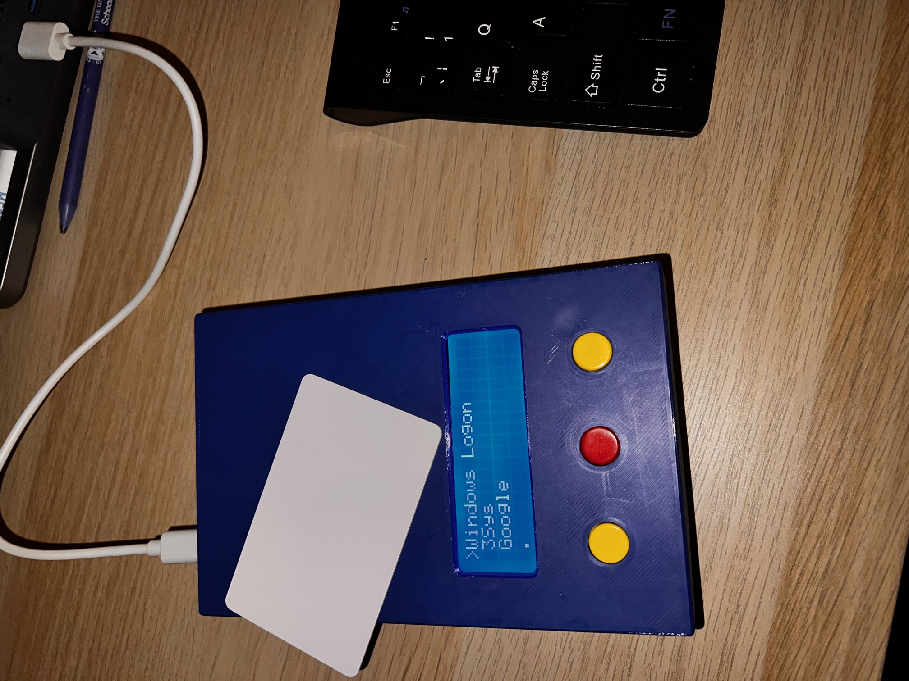

# Proxi-Type

### **Overview**

The **Proxi-Type** is a hardware-based credential injector designed as an assistive technology solution. Following a wrist injury that made repetitive typing painful, this device was created to automate the login process for various workstations. By tapping an authorised RFID tag, the device emulates a USB keyboard and securely types credentials.

### **Key Features**

* **Assistive HID Injection:** Emulates a standard USB keyboard; no drivers or software required on the host PC.
* **Secure Authentication:** Supports 1 Master Key and 2 User Key slots.
* **Interactive Serial Config:** Manage 5 unique credential slots (Service Name, Username, Password) via an interactive Serial wizard.
* **UK Keyboard Localisation:** Custom logic to handle British keyboard layouts, correctly rendering symbols like `@`, `"`, and `#`.
* **Emergency Hardware Reset:** A physical "cheat-code" bypass to wipe the system if the Master Key is lost.

---

## 🚀 Quick Start Guide

### **1. Hardware Setup**

Connect the device via USB. The LCD will display the **Proxi-Type** splash screen and load your menu. Use the **UP** and **DOWN** buttons to navigate and **SELECT** to choose an entry.

### **2. The "First Run" (Setting the Master Key)**

1. Scroll to `*** Configure ***` and press **SELECT**.
2. If no Master Key is set, the system grants **Emergency Access**.
3. Open the **Arduino Serial Monitor** (Baud: 9600, Newline).
4. Type `AUTH 0` and tap your intended Master Card on the reader.
5. Type `WRITE` to save permanently.

### **3. Editing Credentials**

While in the Serial Config menu:

1. Type `EDIT`.
2. Follow the prompts to enter the **Slot Number (0-4)**, **Service Name**, **Username**, and **Password**.
3. Type `WRITE` to save changes to the EEPROM.

---

## 🆘 Emergency Procedures

### **Hardware Reset (Manual Wipe)**

If you are locked out or the EEPROM contains corrupt data:

1. **Unplug** the device.
2. **Hold** both the **UP** and **DOWN** buttons.
3. **Plug in** the device while continuing to hold the buttons.
4. When `HARDWARE RESET` appears, press the **SELECT** button **3 times**.
5. The system will wipe all keys and credentials, returning you to the default state.

---

## 🛠️ Parts List

| Item | Qty | Component Description | Purpose |
| --- | --- | --- | --- |
| **Microcontroller** | 1 | Arduino Leonardo (or Pro Micro) | Logic & Native USB HID support. |
| **RFID Reader** | 1 | RC522 RFID Module (13.56MHz) | Authenticates users via tags. |
| **LCD Display** | 1 | 2004 LCD (20x4 Characters) | System UI. |
| **I2C Interface** | 1 | PCF8574 I2C Backpack | Reduces LCD wiring to 2 pins. |
| **Input** | 3 | Momentary Push Buttons | Navigation (Up, Down, Select). |
| **Authorisation** | 3+ | Mifare Classic 1K Tags | Master and User keys. |

---

## 🔌 Wiring Map

| Component | Pin (Leonardo) | Pin (Component) |
| --- | --- | --- |
| **LCD (I2C)** | 2 (SDA) / 3 (SCL) | SDA / SCL |
| **RFID (SPI)** | 10 | SDA (SS) |
| **RFID (SPI)** | 14 (MISO) / 16 (MOSI) | MISO / MOSI |
| **RFID (SPI)** | 15 (SCK) | SCK |
| **RFID (Power)** | 3.3V | 3.3V (**IMPORTANT**) |
| **Buttons** | 7, 8, 6 | Up, Down, Select |

---

### **Technical Tips for the Build**

* **Pro Micro vs Leonardo:** If you use a **Pro Micro**, the SPI pins (MISO/MOSI/SCK) are physically on pins 14, 16, and 15. On the full-sized **Leonardo**, they are often *only* accessible via the 6-pin ICSP header in the middle of the board.
* **Current Draw:** The RFID reader and the LCD backlight together can pull a decent amount of current. If the LCD looks dim or the RFID fails to read, double-check that your USB cable is high quality.
* **I2C Address:** If the screen lights up but shows no text, ensure the I2C address in the code (`0x27`) matches your hardware. You might also need to turn the small blue potentiometer on the back of the LCD to adjust the contrast.
* **RFID Voltage:** When assembling the Proxi-Type, pay close attention to the RFID module power. The RC522 is strictly a 3.3V device. Connecting it to the 5V rail will likely burn out the chip.
* **OnShape enclosure:**  Feel free to copy the enclosure here and 3d print your own.
If you make a less boring design, please share.

https://cad.onshape.com/documents/0ef05c768de59ed3a16de24d/w/20c9785c92aee0c8e3add6a8/e/77e8d892766bfce11dbebde7

⚖️ License

Distributed under the GNU v3 License.

    Permission is hereby granted, free of charge, to any person obtaining a copy of this software and associated documentation files...

Please feel free to modify, fork, or improve upon this design! I'm not sure about the name and the case is very dull, but it does the job. 

Andy. 15 March 2026
